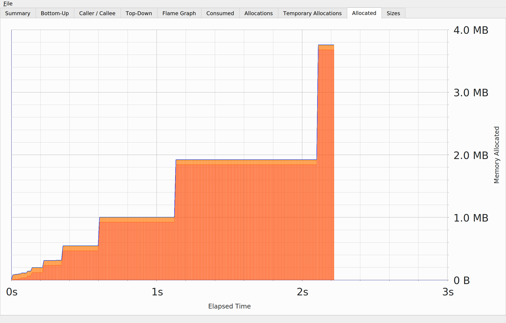

# Python vs Rust for simulation
### Simulation scenario
- 1 day
- 200 cars
- 2000 users
- 0.2 probability to spawn a request
- some free car is assigned to the first pending request
- reuqetss can exprie
- requsts can be fulfilled within 100 ticks

### Python
##### Tests
only sample tests implemented

#### Lines of code with documentation
in `simulation` folder  run:`find . -name 'simple_implementation.py' | xargs wc -l`
or `tokei simple_implementation.py`

#### Performance 
`hyperfine "python NAME.py"`

- less straight-forward implementation =) lol, apparently it's more optimized
```
Benchmark #1: python main.py
  Time (mean ± σ):     111.851 s ±  1.382 s    [User: 111.196 s, System: 1.497 s]
  Range (min … max):   110.063 s … 114.955 s    10 runs
```

- straight-forward implementation
```
Benchmark #1: env/bin/python simple_implementation.py
  Time (mean ± σ):     209.036 s ± 16.916 s    [User: 208.099 s, System: 0.619 s]
  Range (min … max):   193.671 s … 227.164 s    3 runs
```

#### Memory usage
`heaptrack python main.py`


#### Ecosystem
- full support

#### Language versions
- 3.6+ suffice for everything

----
### Rust
##### Tests
only sample tests implemented

#### Lines of code with documentation
in `simulation` folder  run:`find . -name 'src/main.rs' | xargs wc -l`
or `tokei src/main.rs`

#### Performance
```
Benchmark #1: target/release/taxi-simulation
  Time (mean ± σ):     151.4 ms ±   4.9 ms    [User: 114.0 ms, System: 36.0 ms]
  Range (min … max):   145.0 ms … 163.7 ms    18 runs
```

#### Memory usage
 - debug version heaptrack
 

#### Ecosystem
- reduced

#### Language versions

- nightly
- stable
