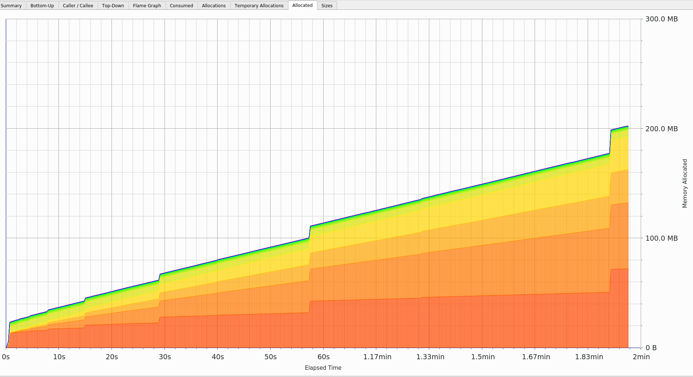

# Python vs Rust fro simulation
### Simulation scenario
- 100x100 box
- 1 day
- 200 cars
- 1000 users
- 0.2 probability to spawn a request
- random free car is assigned to the first pending request in the dict/hashmap

### Python
##### Tests
only sample tests implemented

#### Lines of code with documentation
in `simulation` folder  run:`find . -name '*.py' | xargs wc -l`


#### Performance
```
Benchmark #1: python main.py
  Time (mean ± σ):     111.851 s ±  1.382 s    [User: 111.196 s, System: 1.497 s]
  Range (min … max):   110.063 s … 114.955 s    10 runs

```

#### Memory usage
`heaptrack python main.py`



#### Ecosystem
- full support

#### Language versions
- 3.6+ suffice for everything

----
### Rust
##### Tests
only sample tests implemented

#### Lines of code with documentation
in `simulation` folder  run:`find . -name '*.py' | xargs wc -l`


#### Performance


#### Memory usage


#### Ecosystem


#### Language versions
